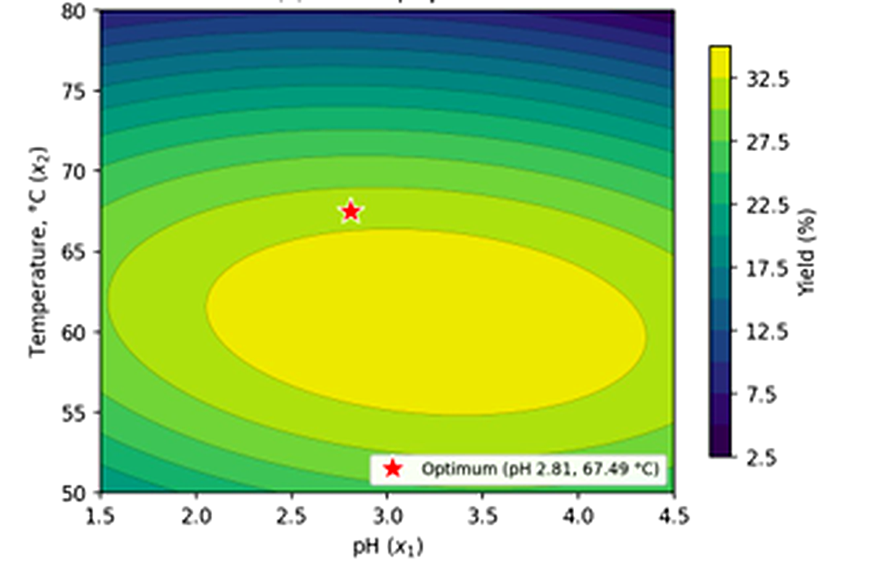
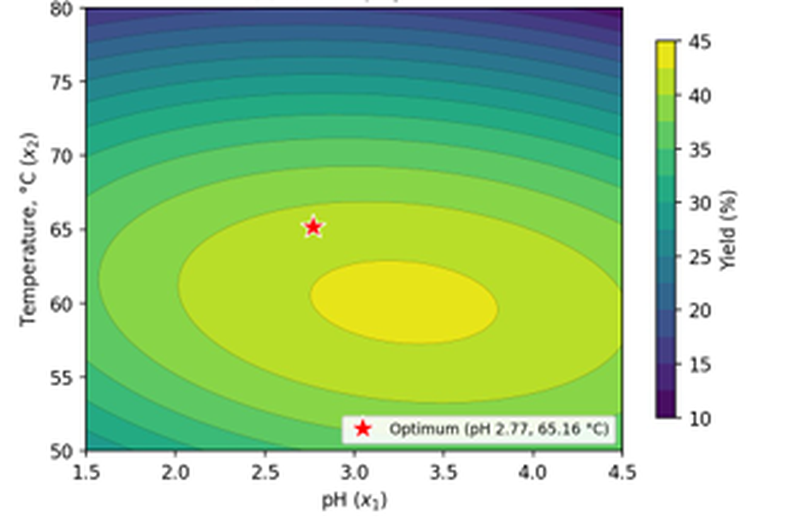
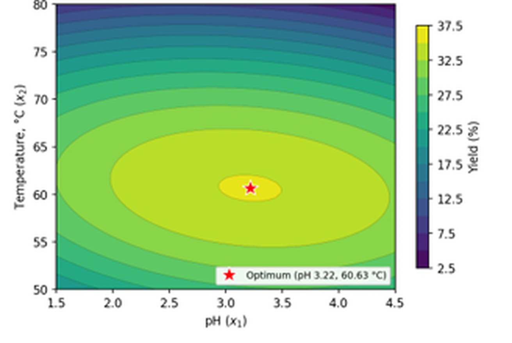
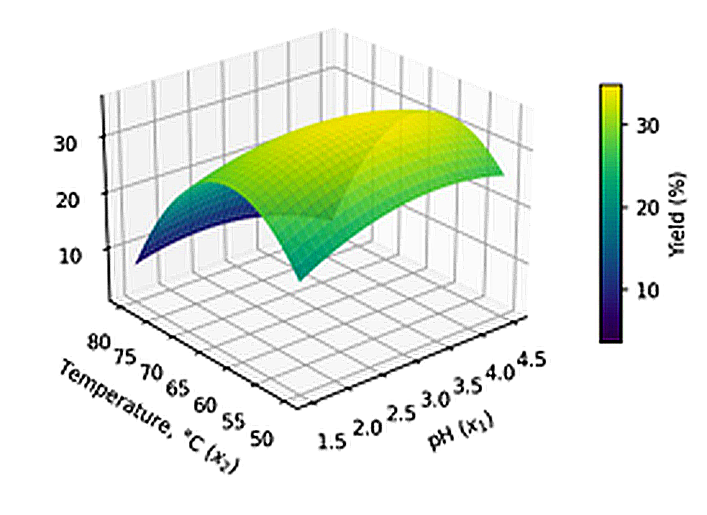
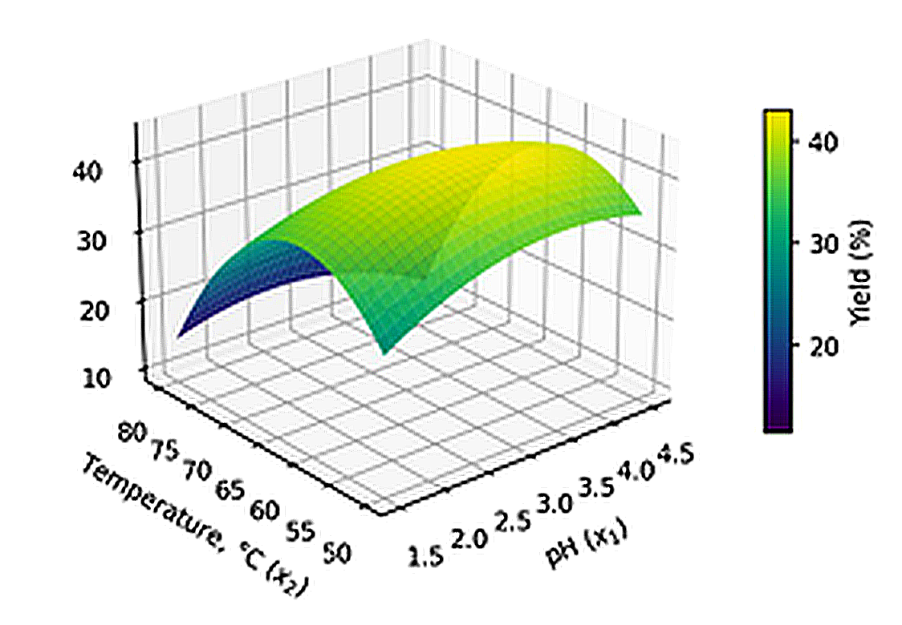
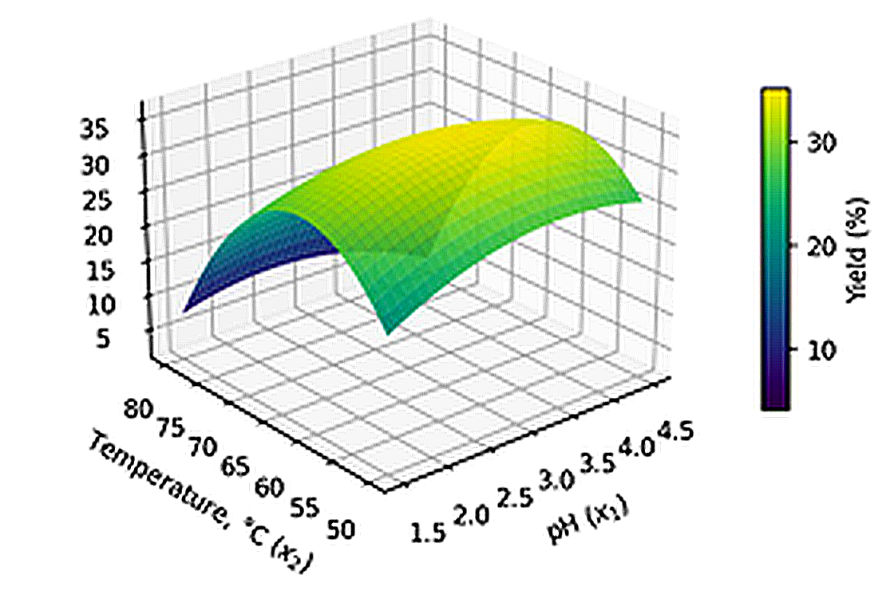
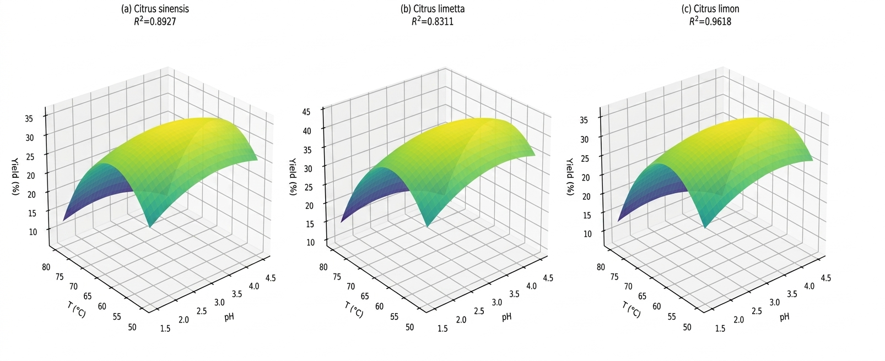

# 🍊 Citrus Peel Pectin Extraction Optimization  
### Response Surface Methodology (RSM) & Bioprocess Design

---

## 📌 Overview
Citrus peel waste represents a high-volume, underutilized resource with significant potential for sustainable biopolymer production. This study investigates the extraction and optimization of pectin from three citrus species:

- Citrus sinensis (Sweet Orange)  
- Citrus limetta (Sweet Lime)  
- Citrus limon (Lemon)  

Using **citric-acid hydrolysis** and **Box–Behnken Response Surface Methodology (RSM)**, the work models, optimizes, and characterizes pectin yield and quality.

---
## 📊 Data & Experimental Results

This study is supported by structured experimental datasets and tabulated results used for modelling, comparison, and optimization of pectin extraction from citrus peels.

### 📂 Dataset Files
- pectin-extraction-experimental-data.csv  
- pectin-extraction-experimental-data.xlsx  

---

## 📑 Summary of Tables

The study includes five key analytical tables:

- **Table 1:** Pectin yield (%) from *Citrus sinensis* (sweet orange) peels at varied pH and extraction temperature (citric-acid hydrolysis, 2 h)

- **Table 2:** Pectin yield (%) from *Citrus limetta* (sweet lime) peels at varied pH and extraction temperature (citric-acid hydrolysis, 2 h)

- **Table 3:** Pectin yield (%) from *Citrus limon* (lemon) peels at varied pH and extraction temperature (citric-acid hydrolysis, 2 h)

- **Table 4:** Box–Behnken RSM optimization outcomes — species-specific operating points and predicted yields (MATLAB R2007b)

- **Table 5:** Physicochemical characterization of extracted pectin across all Citrus species, benchmarked against commercial citrus pectin (Kaya et al., 2014)

---

## 🧠 Optimization Method Overview (RSM)

The study employs **Response Surface Methodology (RSM)** combined with **Box–Behnken design** to optimize pectin extraction conditions.

### Workflow:

1. **Experimental Design**
   - Structured combinations of pH and temperature are generated using Box–Behnken design

2. **Data Collection**
   - Yield responses are recorded for each experimental condition across three Citrus species

3. **Model Development**
   - A quadratic regression model is fitted using MATLAB R2007b

4. **Response Surface Generation**
   - The model visualizes how extraction variables influence yield

5. **Optimization**
   - Mathematical optimization identifies best operating conditions for maximum yield

6. **Validation**
   - Predicted values are compared with experimental outputs to assess model accuracy

### Outcome:
RSM enables efficient multi-variable optimization with reduced experimental load while maintaining strong predictive reliability.

## 🖼️ Process & Optimization Visuals

### Contour Projection

### Response Surface Model

---
### 🖼️ 3D Yield Surfaces of Citrus Species

## ⚡ Quick Insights (1-Minute Read)

- Citrus peel is a **valuable biorefinery feedstock**, not waste  
- Extraction optimized across:
  - pH (1.5–4.2)  
  - Temperature (50–80°C)  
- Highest experimental yields:
  - *C. sinensis* → **29.59%**  
  - *C. limetta* → **32.94%**  
  - *C. limon* → **36.93%**  
- RSM modeling achieved strong predictive performance:
  - R² up to **0.9618**  
- Optimized conditions significantly improved process efficiency  
- All pectins classified as **low-methoxyl**
- *C. limon* shows strongest potential for:
  → Pharmaceutical applications  
  → Calcium-induced gel systems  

---

## 🎯 Key Contributions
- Experimental extraction of pectin from three citrus species  
- RSM-based process optimization using **Box–Behnken design**  
- MATLAB-based quadratic modeling of yield response  
- Physicochemical characterization:
  - Equivalent weight  
  - Methoxyl content  
  - Degree of esterification  
- Identification of optimal industrial candidate (*C. limon*)

---

## 📊 Key Results

| Species        | Yield (%) | R²     | Optimal pH | Temp (°C) |
|----------------|----------|--------|-----------|----------|
| C. sinensis    | 29.59    | 0.8927 | 2.81      | 67.49    |
| C. limetta     | 32.94    | 0.8311 | 2.77      | 65.16    |
| C. limon       | 36.93    | 0.9618 | 3.22      | 60.63    |

---

## 📄 Publication
📍 Published on Zenodo  
🔗 (https://doi.org/10.5281/zenodo.19781987) 
📌 DOI: 10.5281/zenodo.19781987

 **[Download Full Paper](./paper/citrus-pectin-rsm-optimization.pdf)**
---

## 📂 Repository Structure
/paper → Published journal paper (PDF)
/figures → Process diagrams and response surface plots

---

## 🧪 Methods
- Citric-acid hydrolytic extraction  
- One-factor-at-a-time (OFAT) screening  
- Box–Behnken experimental design  
- Quadratic model fitting (MATLAB R2007b)  

---

## 🏷️ Keywords
Pectin, Citrus Waste, RSM, Box-Behnken, Bioprocess Optimization, Sustainable Materials

---

## 👤 Author
Otuekong Edet Bassey

---

## 📜 License
Refer to Zenodo publication terms for reuse and citation.

## 📂 Repository Structure
